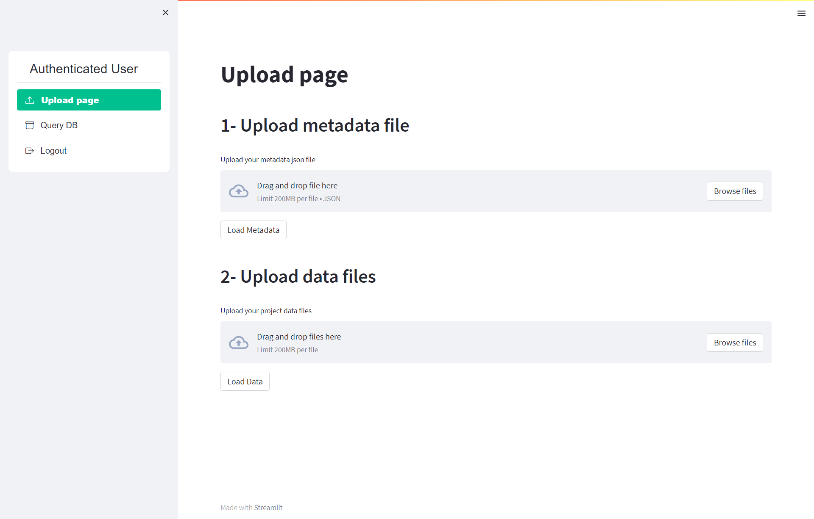

Upload data files via Web interface
====================

Once you made the metadata file, you can upload the files following this link (`web interface`__).

__ https://ai4mat.enea.it/dashboard/

.. note::
  The registration is required. Follow the `guide video`__ (main page) if you didn't already.

__ https://ai4mat.enea.it/dashboard/

Once logged in, you will see a web page like the following:

For each process, you have to cyclically upload the metadata file (step n°1) and related data files (step n°2).