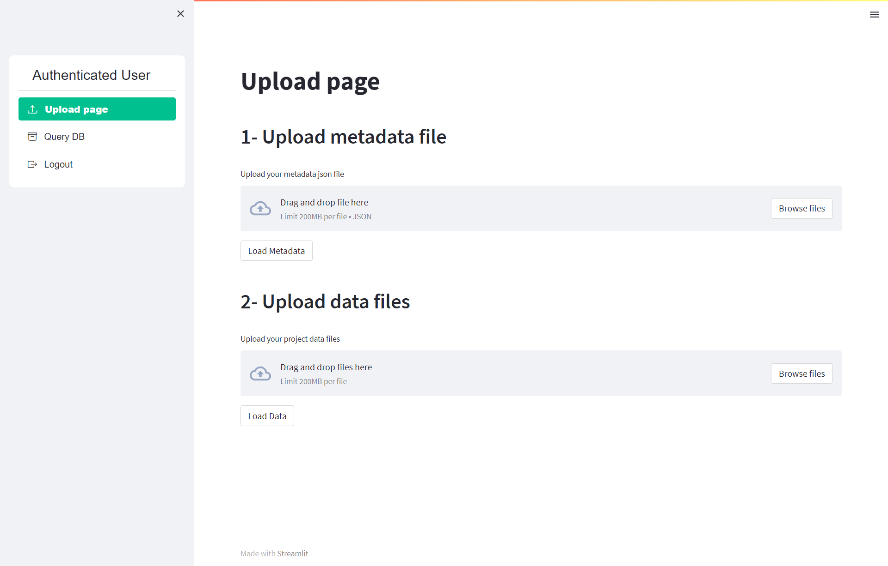
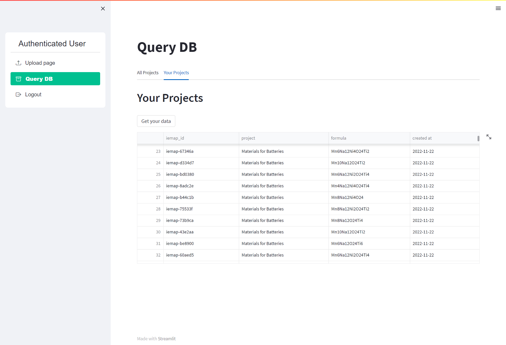

Upload data files via Web interface
====================

Once you made the metadata file, you can upload the files following this link (`web interface`__).

__ https://ai4mat.enea.it/dashboard/

.. note::
  The registration is required. Follow the `guide video`__ (main page) if you didn't already.

__ https://ai4mat.enea.it/dashboard/

Once logged in, you have to upload the metadata file (step n°1) and related data files (step n°2) for each process.

Finally, you should check the uploading using the `Query DB` web page and selecting **Your project**.

